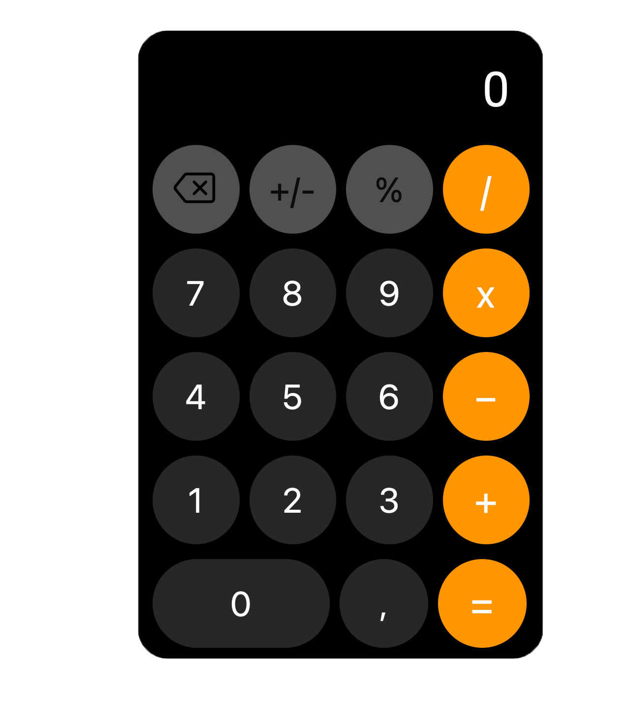

# 🧮 Calculator

## 🎯 Purpose
The main goal of making this project was to practice web programming: HTML, CSS, JavaScript (basic frontend technologies).

## ✨ Features
- Basic arithmetic operations (+, -, *, /, %, +/-, del)
- The design closely resembles the Apple calculator

## 🚀 Usage
The calculator is available at this link:
https://calculator-apple-six.vercel.app

## 🛠 Technologies
- **HTML**
- **CSS**
- **JavaScript**

## 📸 Screenshot

